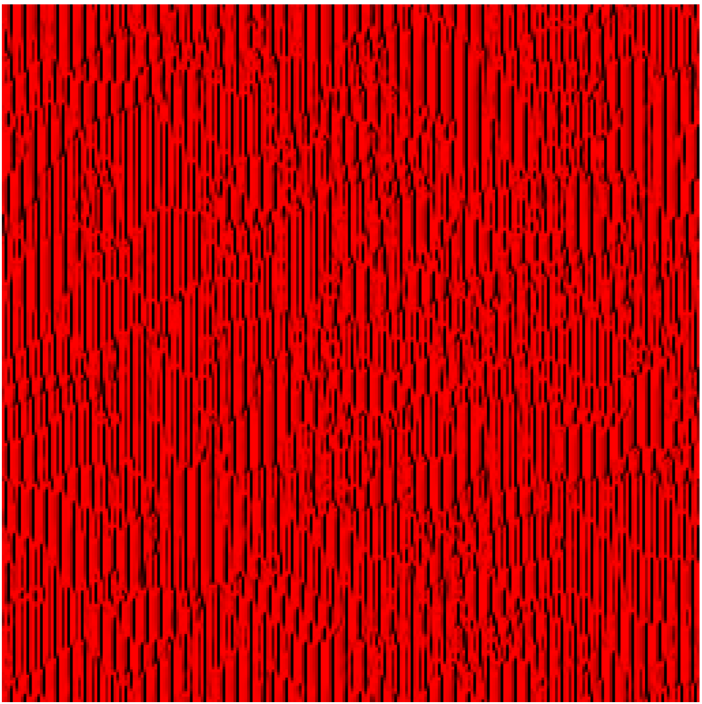
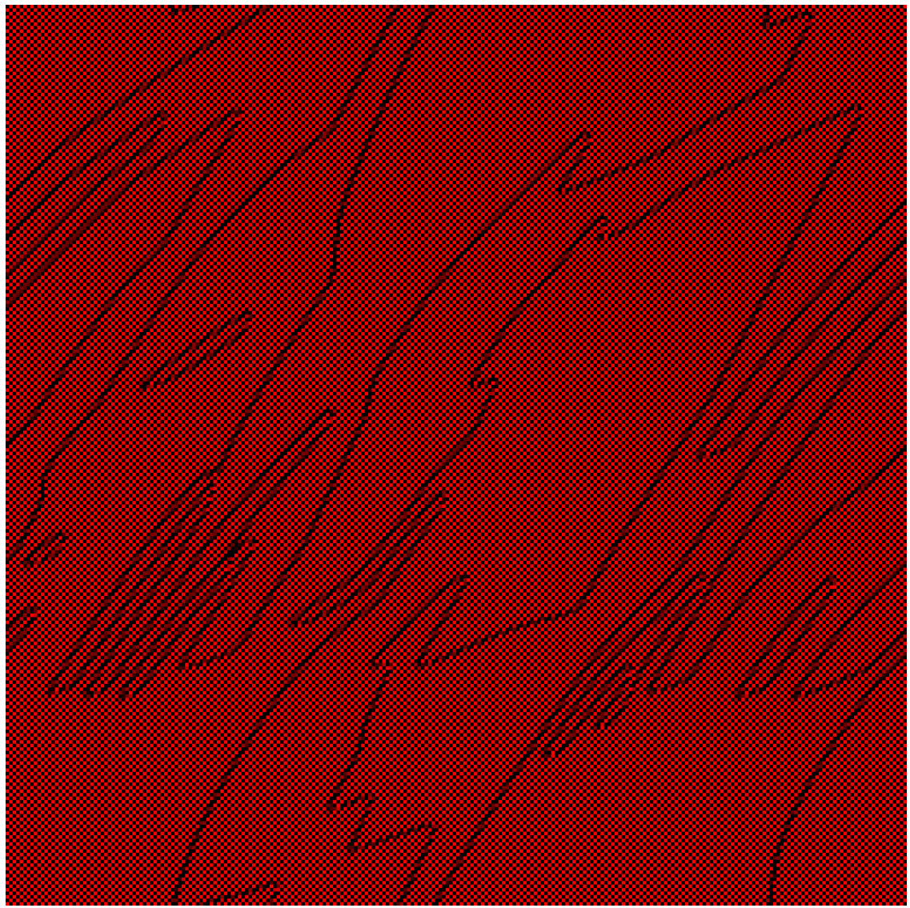
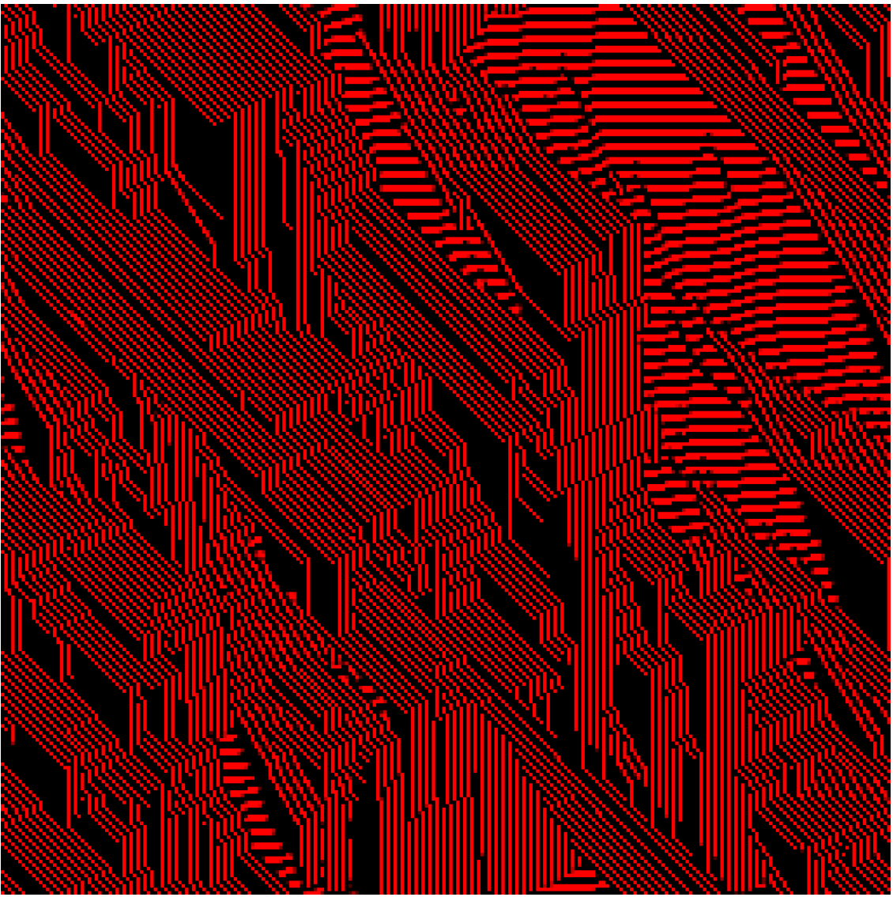

Basic Neural Cellular Automata implemented in WebGPU. Inspired by this video - https://www.youtube.com/watch?v=3H79ZcBuw4M

Basic code taken from Game of Life Implementation of Google Codelabs tutorials on WebGPU - https://codelabs.developers.google.com/your-first-webgpu-app#0

Just click on the blank canvas to see patterns. To change the patterns, change the kernel values and activation functions used in the compute shader. 

Some patterns - 

